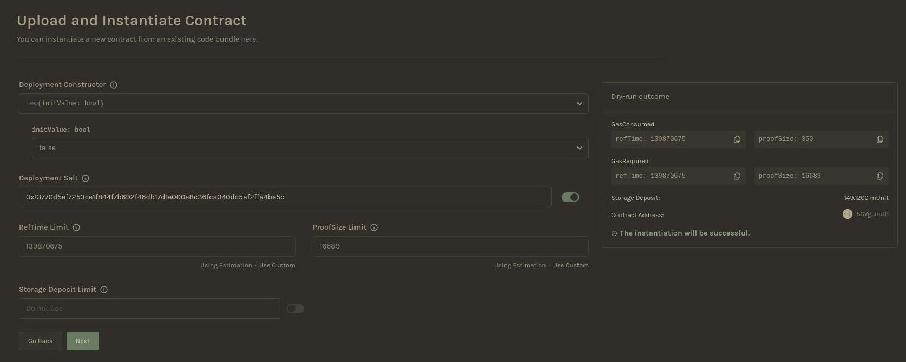
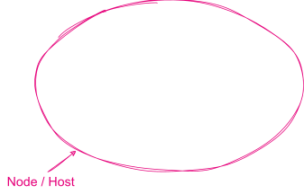

# Wasm Smart Contracts in Ink!

A working programmer’s guide

Notes:

- ask questions during the lecture, don't wait until the end
- practical, but we go deeper where needed
- some complexity is omitted in the examples (examples are not a production code)

---

## Intro: ink! vs. Solidity

|                 | ink!                        | Solidity      |
| --------------- | --------------------------- | ------------- |
| Virtual Machine | Any Wasm VM                 | EVM           |
| Encoding        | Wasm                        | EVM Byte Code |
| Language        | Rust                        | Standalone    |
| Constructors    | Multiple                    | Single        |
| Tooling         | Anything that supports Rust | Custom        |
| Storage         | Variable                    | 256 bits      |
| Interfaces?     | Yes: Rust traits            | Yes           |

Notes:

- students are freshly of an EVM lecture so might be wondering why another SC language
- Virtual Machine: any Wasm VM: yes in theory, in practice bound pretty close to the platform it runs on (Substrate & the contracts pallet)
- Tooling: Solidity has been around for years, enjoys the first-to-market advantage (but ink! is a strong contender)
- The EVM operates on 256 bit words (meaning anything less than 32 bytes will be treated by the EVM as having leading zeros)

---

## Intro: ink! overview

- DSL in Rust
- Inherits all the benefits of Rust
  - Modern functional language
  - Type & Memory safety
- Compiled to Wasm
  - Ubiquitous
  - Fast

Notes:

- ink! is not a separate language
- enjoys access to a vast collection of libraries developed for other purposes
- Wasm is targeting the browsers and quickly becoming the "assembly" od the web in lieu of JS

---

## Intro: ink! & Substrate


Notes:

- Technically you could take a SC written in ink! and deploy it to any Wasm-powered blockchain.
  - in practice not that straight-forward.
- ink! is closely tied to the larger Substrate framework.
- Substrate is a framework for developing customized blockchain runtimes from composable pallets.

---

## Intro: ink! & Substrate


Notes:

- contracts written in ink! are compiled to Wasm bytecode
- pallet contracts provides
  - instrumentation
  - execution engine
  - gas metering

---


Notes:

- pallet contracts is oblivious to the programming language
- it accepts Wasm bytecode and executes it's instructions

---


Notes:

- contracts itself can be written in ink!

---


Notes:

- But also any other language that compilers to Wasm
  - Solang
  - or ask!

---

## Development: Prerequisites

Install the required tooling

```sh
sudo apt install binaryen
rustup toolchain install nightly
rustup component add rust-src --toolchain nightly
rustup target add wasm32-unknown-unknown --toolchain nightly
cargo install dylint-link
cargo install cargo-contract --force
```

- [binaryen](https://github.com/WebAssembly/binaryen) is a compiler for WebAssembly.
- [dylint-link](https://github.com/trailofbits/dylint) adds DSL specific lints.

Notes:

- Binaryen is a compiler and toolchain infrastructure library for WebAssembly
- at the moment ink! uses a few unstable Rust features, thus nightly is require
- rust source code is needed to compile it to wasm
- wasm target is added
- cargo-contract is a batteries included CLI tool for compiling, deploying and interacting with the contracts

---

## Development: cargo-contract

Create a contract

```sh
cargo contract new flipper
```

```sh
/home/user/flipper:
  drwxrwxr-x 2 filip filip 4096 Jul  7 11:11 .
  drwxr-xr-x 5 filip filip 4096 Jul  7 11:11 ..
  -rwxr-xr-x 1 filip filip  573 Jul  7 11:11 Cargo.toml
  -rwxr-xr-x 1 filip filip  285 Jul  7 11:11 .gitignore
  -rwxr-xr-x 1 filip filip 5186 Jul  7 11:11 lib.rs
```

Notes:

- ask how many student have written some code in Rust, this should feel familiar to them

---

## Development: Cargo.toml

<div style="font-size: 0.72em;">

```toml
[package]
name = "flipper"
version = "0.1.0"
authors = ["[your_name] <[your_email]>"]
edition = "2021"

[dependencies]
ink = { version = "5.0.0", default-features = false }

[dev-dependencies]
ink_e2e = { version = "5.0.0" }

[lib]
path = "lib.rs"

[features]
default = ["std"]
std = [
    "ink/std",
]
ink-as-dependency = []
e2e-tests = []
```

</div>

Notes:

- who knows why is the std library not included by default?
- Answer: contracts are compiled to Wasm (executed ib a sandboxed environment with no system interfaces, no IO, no networking)

---
## Developing contracts

- Every ink! contract is required to contain:
  - Exactly one #[ink(storage)] struct.
  - At least one #[ink(constructor)] function.
  - At least one #[ink(message)] function.

---
## Developing contracts

contract code

<div style="font-size: 0.62em;">

```rust
#[ink::contract]
pub mod flipper {

    #[ink(storage)]
    pub struct Flipper {
        value: bool,
    }

    impl Flipper {
        #[ink(constructor)]
        pub fn new(init_value: bool) -> Self {
            Self { value: init_value }
        }

        #[ink(constructor)]
        pub fn default() -> Self {
            Self::new(Default::default())
        }

        #[ink(message)]
        pub fn flip(&mut self) {
            self.value = !self.value;
        }

        #[ink(message)]
        pub fn get(&self) -> bool {
            self.value
        }
    }
}
```

</div>

Notes:

- basic contract that flips a bit in storage
- contract will have a storage definition, constructor(s), messages
- grouped in a module

---

## Developing contracts: Compilation & artifacts

Compile:

```sh
cargo +nightly contract build
```

Artifacts:

```
 [1/*] Building cargo project
    Finished release [optimized] target(s) in 0.09s

The contract was built in RELEASE mode.

Your contract artifacts are ready.
You can find them in:
/home/CloudStation/Blockchain-Academy/flipper/target/ink

  - flipper.contract (code + metadata)
  - flipper.wasm (the contract's code)
  - flipper.json (the contract's metadata)
```

Notes:

- produces Wasm bytecode and some additional artifacts:
- .wasm is the contract compiled bytecode
- .json is contract ABI aka metadata (for use with e.g. dapps)
  - definitions of events, storage, transactions
- .contracts is both of these together

---
## Starting the substrate

To run a local node:

```sh
git clone https://github.com/paritytech/substrate-contracts-node.git
cd substrate-contracts-node/
cargo build --release
./target/release/substrate-contracts-node --dev
```
<br>
<a href="https://polkadot.js.org/apps/?rpc=ws%3A%2F%2F127.0.0.1%3A9944" target="_blank">Access the node with Polkadot.js</a>

---

## Developing contracts: instantiate

Deploy:

```sh
cargo contract instantiate --constructor default --suri //Alice \
  --skip-confirm --execute
```

Output:

<div style="font-size: 0.82em;">

```sh [13-14]
 Dry-running default (skip with --skip-dry-run)
    Success! Gas required estimated at Weight(ref_time: 138893374, proof_size: 16689)
...
  Event Contracts ➜ CodeStored
         code_hash: 0xbf18c768eddde46205f6420cd6098c0c6e8d75b8fb042d635b1ba3d38b3d30ad
       Event Contracts ➜ Instantiated
         deployer: 5GrwvaEF5zXb26Fz9rcQpDWS57CtERHpNehXCPcNoHGKutQY
         contract: 5EXm8WLAGEXn6zy1ebHZ4MrLmjiNnHarZ1pBBjZ5fcnWF3G8
...
       Event System ➜ ExtrinsicSuccess
         dispatch_info: DispatchInfo { weight: Weight { ref_time: 2142580978, proof_size: 9009 }, class: Normal, pays_fee: Yes }

   Code hash 0xbf18c768eddde46205f6420cd6098c0c6e8d75b8fb042d635b1ba3d38b3d30ad
    Contract 5EXm8WLAGEXn6zy1ebHZ4MrLmjiNnHarZ1pBBjZ5fcnWF3G8
```

</div>

Notes:

- we see a bunch of information on gas usage
- we see two events one for storing contract code another for instantiating the contract
  - why is that?
  - code & instance are separated, we will come back to that
- finally we see code hash and the newly created contracts address

---

## Interacting with the contracts: queries

```sh
cargo contract call --contract 5EXm8WLAGEXn6zy1ebHZ4MrLmjiNnHarZ1pBBjZ5fcnWF3G8 \
  --message get --suri //Alice --output-json
```
- Replace the contract address in the command above with your contract address
- contract state?
- tip: `default` constructor was called

Notes:

- who can tell me what will be the contract state at this point?

---

## Interacting with the contracts: queries

<!-- Query the contract state: -->

<!-- ```sh -->
<!-- cargo contract call --contract 5EXm8WLAGEXn6zy1ebHZ4MrLmjiNnHarZ1pBBjZ5fcnWF3G8 -->
<!--   --message get --suri //Alice --output-json -->
<!-- ``` -->

<!-- Result: -->

```[6]
"data": {
  "Tuple": {
    "ident": "Ok",
    "values": [
      {
        "Bool": false
      }
    ]
  }
}
```

---

## Interacting: transactions

Sign and execute a transaction:

```sh
cargo contract call --contract 5EXm8WLAGEXn6zy1ebHZ4MrLmjiNnHarZ1pBBjZ5fcnWF3G8 \
  --message flip --suri //Alice --skip-confirm --execute
```

Query the state:

```sh
cargo contract call --contract 5EXm8WLAGEXn6zy1ebHZ4MrLmjiNnHarZ1pBBjZ5fcnWF3G8 \
  --message get --suri //Alice --output-json
```

Result:

<div style="font-size: 0.82em;">

```[6]
"data": {
  "Tuple": {
    "ident": "Ok",
    "values": [
      {
        "Bool": true
      }
    ]
  }
}
```

</div>

Notes:

- if I query it again the bit is flipped
- no surprises there

---

## Getting Balance for Rococo Contracts


- Install Polkadot.js extension and create an account. [Polkadot.js](https://polkadot.js.org/extension/)
- Link: [Rococo Faucet](https://faucet.polkadot.io/rococo)
---

## Dev environment: Contracts UI


- Link: [Contracts UI](https://ui.use.ink/?rpc=wss://rococo-contracts-rpc.polkadot.io)

- You can use the Parachain Contrats (Rococo) or the Local Node to deploy your contract.

---

## Dev environment: Contracts UI


- Upload the file `target/ink/flipper.contract`

---

## Dev environment: Contracts UI



Notes:

- there is also a graphical env for deploying & interacting with contracts
- deploy & create an instance of flipper

---

## Dev environment: Contracts UI


Notes:

- call a transaction

---

## Dev environment: Contracts UI


Notes:

- query state

---

## Developing contracts: Constructors

```rust [8,13,18|14,19,8-10|3-5,9]
// From examples/flipper
#[ink(storage)]
pub struct Flipper {
    value: bool,
}

#[ink(constructor)]
pub fn new(init_value: bool) -> Self {
    Self { value: init_value }
}

#[ink(constructor)]
pub fn default() -> Self {
    Self::new(Default::default())
}
```
- Constructors return the initial storage
- Constructors can call other constructors
- You can find the flipper with the changes commented on [examples/flipper](https://github.com/ditavia-br/polkadot-at-universities/tree/main/examples/flipper).

Notes:

- lets dissect what a contract code is built like
- no limit of the number of constructors
- constructors can call other constructors
- constructors return the initial storage
- a lot of complexity conveniently hidden behind macros

---

## Developing contracts: Queries

```rust
// From examples/flipper
#[ink(message)]
pub fn get(&self) -> bool {
    self.value
}
```

- `#[ink(message)]` is how we tell ink! this is a function that can be called on the contract
- `&self` is a reference to the contract's storage

<!-- #you’re calling this method on  -->

Notes:

- returns information about the contract state stored on chain
- reaches to the storage, decodes it and returns the value

---

## Developing contracts: Mutations

```rust [3-5|8-10]
// From examples/flipper
#[ink(message)]
pub fn get(&self) -> bool {
    self.value
}

#[ink(message)]
pub fn flip(&mut self) {
    self.value = !self.value;
}
```

- `&self` is a imutable reference to the object you’re calling this method on
- `&mut self` is a mutable reference

Notes:

- constructors are inherently payable
- ink! message will reject calls with funds if it's not marked as such
- mutable references allow me to modify the storage.
- queries are for free, mutations are metered (you pay gas)
  - you will also pay for queries within such transactions

---

## Contracts: Error handling

<div style="font-size: 0.72em;">

```rust [1-4|8-11,16|14,20]
pub enum MyResult<T, E> {
    Ok(value: T),
    Err(msg: E),
}

#[derive(Debug, PartialEq, Eq, Encode, Decode)]
#[cfg_attr(feature = "std", derive(scale_info::TypeInfo))]
pub enum MyError {
    InkEnvError(String),
    BettingPeriodNotOver,
}

#[ink(message)]
pub fn spin(&mut self) -> Result<()> {
    if !self.is_betting_period_over() {
        return Err(MyError::BettingPeriodNotOver);
    ...
};

pub type Result<T> = core::result::Result<T, MyError>;
```

</div>

- ink! uses idiomatic Rust error handling: `Result<T,E>` type
- Use the Err variant to pass your own semantics
- Type aliases reduce boilerplate & enhance readability

Notes:

- ink! uses idiomatic Rust error handling
- ~~messages are the `system boundary`~~
- returning error variant or panicing reverts the transaction
  - panicing is the same as returning Err variant (`Result` is just being nice)

---

## Contracts: Error handling

```rust
/// From examples/ink-examples/erc20
/// The ERC-20 error types.
#[derive(Debug, PartialEq, Eq)]
#[ink::scale_derive(Encode, Decode, TypeInfo)]
pub enum Error {
    /// Returned if not enough balance to fulfill a request is available.
    InsufficientBalance,
    /// Returned if not enough allowance to fulfill a request is available.
    InsufficientAllowance,
}

/// The ERC-20 result type.
pub type Result<T> = core::result::Result<T, Error>;
```

- Defining error for insifficient balance and allowance
- Defining Result where these errors can occurs

---

## Contracts: Error handling

```rust []
/// From examples/ink-examples/erc20
/// Transfers `value` amount of tokens from the caller's account to account `to`.

#[ink(message)]
pub fn transfer(&mut self, to: AccountId, value: Balance) -> Result<()> {
    let from = self.env().caller();
    self.transfer_from_to(&from, &to, value)
}
```
- On success a `Transfer` event is emitted.
- Returns `InsufficientBalance` error if there are not enough tokens

---

## Error handling: call stack

```rust
// Change on the flip contract

#[ink(message)]
pub fn flip(&mut self) {
    self.value = !self.value;

    if self.env().block_number() % 2 != 0 {
      panic!("Oh no!")
    }

}
```

- what is the state of this contract if the tx is called in an odd block number?

Notes:

- answer: whatever it was prior to the tx:
  - returning error variant reverts the entire tx on the call stack

---

## Error handling: call stack


- answer: whatever it was prior to the tx:
  - returning error variant reverts the entire tx on the call stack
- It won't change the state of the contract
- This image is from the `polkadot.js`

---

## Error handling: call stack


- On Contract UI if you try to interact on an odd block it will return the panic message on the debug message.

---

## Contracts: Events

```rust
//From ink-examples/erc20
#[ink(event)]
pub struct Transfer {
    #[ink(topic)]
    from: Option<AccountId>,
    #[ink(topic)]
    to: Option<AccountId>,
    value: Balance,
}
```

- Events are a way of letting the outside world know about what's happening inside the contract.
- `#[ink(event)]` is a macro that defines events.
- Topics mark fields for indexing.
- You can find the erc20 Contract on [examples/ink-examples/erc20](https://github.com/ditavia-br/polkadot-at-universities/blob/main/examples/ink-examples/erc20)

Notes:

- events are especially important for dapps
- storage is expensive: reading e.g. aggregate data from chain directly is impossible / impractical
- dapps the can listen to the event, normalize & store off-chain and answer e.g. complex queries

---

## Contracts: Events

```rust
   #[ink(event)]
   pub struct Flipped {
       #[ink(topic)]
       value: bool,
   }
```

- For the next example you need to define this event on the flip contract.

---
## Contracts: Events

```rust
// Change the flip function

#[ink(message)]
pub fn flip(&mut self) {

    self.env().emit_event(
        Flipped {
            value: self.value,
        }
    );

    self.value = !self.value;

    if self.env().block_number() % 2 == 0 {
      panic!("Oh no!")
    }

}
```

- What happens to the events from reverted transactions?
- Will this event be emitted in an odd block?
- Yes, but only because it reverted the condition 

Notes:

- answer: yes, but only because I reverted the condition :)

---


## Deeper dive: Storage

```rust
// From erc20
use ink::storage::Mapping;

#[ink(storage)]
#[derive(Default)]
pub struct Token {
    total_supply: Balance,
    balances: Mapping<AccountId, Balance>,
    allowances: Mapping<(AccountId, AccountId), Balance>,
}
```

- what does this code actually put into the chain storage?

Notes:

- now that we dipped our toes lets dissect more
- starting with the storage
- what does this code actually put into the chain storage?

---


<font color="#8d3aed">SCALE</font> (_<font color="#8d3aed">S</font>imple <font color="#8d3aed">C</font>oncatenated <font color="#8d3aed">A</font>ggregate <font color="#8d3aed">L</font>ittle <font color="#8d3aed">E</font>ndian_)

Notes:

- Pallet contracts storage is organized like a key-value database
- each storage cell has a unique storage key and points to a SCALE encoded value
- SCALE codec is not self-describing (vide metadata)

---

## SCALE: examples of different types

<div style="font-size: 0.72em;">

| Type         | Decoding                              | Encoding                     | Remark                                                                         |
| ------------ | ------------------------------------- | ---------------------------- | ------------------------------------------------------------------------------ |
| Boolean      | true                                  | 0x0                          | encoded using least significant bit of a single byte                           |
|              | false                                 | 0x1                          |                                                                                |
| Unsigned int | 42                                    | 0x2a00                       |                                                                                |
| Enum         | enum IntOrBool { Int(u8), Bool(bool)} | 0x002a and 0x0101            | first byte encodes the variant index, remaining bytes encode the data          |
| Tuple        | (3, false)                            | 0x0c00                       | concatenation of each encoded value                                            |
| Vector       | \[4, 8, 15, 16, 23, 42\]              | 0x18040008000f00100017002a00 | encoding of the vector length followed by conatenation of each item's encoding |
| Struct       | {x:30u64, y:true}                     | \[0x1e,0x0,0x0,0x0,0x1\]     | names are ignored, Vec<u8> structure, only order matters                       |

</div>

Notes:

- this table is not exhaustive
- struct example: stored as an vector, names are ignored, only order matters, first four bytes encode the 64-byte integer and then the least significant bit of the last byte encodes the boolean

---

## Storage: Packed Layout

```rust [7]
// From erc20
use ink::storage::Mapping;

#[ink(storage)]
#[derive(Default)]
pub struct Token {
    total_supply: Balance,
    balances: Mapping<AccountId, Balance>,
    allowances: Mapping<(AccountId, AccountId), Balance>,
}
```

- By default ink! stores all storage struct fields under a single storage cell (`Packed` layout)

Notes:

- We talked about the kv database that the storage is, now how is it used precisely
- Types that can be stored entirely under a single storage cell are called Packed Layout
- by default ink! stores all storage struct fields under a single storage cell
- as a consequence message interacting with the contract storage will always need to read and decode the entire contract storage struct
- .. which may be what you want or not

---

## Storage: Packed Layout

```rust [2-5,8]
// Change to this on the flip contract
use ink::storage::traits::{
    StorageKey,
    ManualKey,
};

#[ink(storage)]
pub struct Flipper<KEY: StorageKey = ManualKey<0xcafebabe>> {
    value: bool,
}
```

- The storage key of the contracts root storage struct defaults to `0x00000000`
- However you may store it under any arbitrary 4 bytes key instead

---

## Storage: Packed Layout

<div style="font-size: 0.82em;">

```json
"storage": {
  "root": {
    "layout": {
      "struct": {
        "fields": [
          {
            "layout": {
              "leaf": {
                "key": "0xcafebabe",
                "ty": 0
              }
            },
            "name": "value"
          }
        ],
        "name": "Flipper"
      }
    },
    "root_key": "0xcafebabe"
  }
}
```

- You can find this json on target/ink/flipper.json after the build

</div>

Notes:

- demonstration of the packed layout - value is stored under the root key

---

## Storage: Un-packed Layout

```rust [2,8-9]
//From ink-examples/erc20
use ink::storage::Mapping;

#[ink(storage)]
#[derive(Default)]
pub struct Token {
    total_supply: Balance,
    balances: Mapping<AccountId, Balance>,
    allowances: Mapping<(AccountId, AccountId), Balance>,
}
```

- Mapping consists of a key-value pairs stored directly in the contract storage cells.
- Each Mapping value lives under it's own storage key.
- Mapping values do not have a contiguous storage layout: **it is not possible to iterate over the contents of a map!**

Notes:

- Use Mapping when you need to store a lot of values of the same type.
- if your message only accesses a single key of a Mapping, it will not load the whole mapping but only the value being accessed.
- there are other collection types in ink!: HashMap or BTreeMap (to name a few).
  - these data structures are all Packed, unlike Mapping!

---

## Storage: working with `Mapping`

```rust
pub fn transfer(&mut self) {
    let caller = self.env().caller();

    let balance = self.balances.get(caller).unwrap_or(0);
    let endowment = self.env().transferred_value();

    balance += endowment;
}
```

- what is wrong here?

Notes:

- working with mapping:
- Answer: Mapping::get() method will result in an owned value (a local copy), as opposed to a direct reference into the storage.
  Changes to this value won't be reflected in the contract's storage "automatically".
  To avoid this common pitfall, the value must be inserted again at the same key after it was modified.
  The transfer function from above example illustrates this:

---

## Storage: working with `Mapping`

```rust
pub fn transfer(&mut self) {
    let caller = self.env().caller();

    let balance = self.balances.get(caller).unwrap_or(0);
    let endowment = self.env().transferred_value();

    self.balances.insert(caller, &(balance + endowment));
}
```

- `Mapping::get()` returns a local copy, not a mutable reference to the storage!

Notes:

- working with mapping:
- `Mapping::get()` method will result in an owned value (a local copy).
- Changes to this value won't be reflected in the contract's storage at all!
- you need to inserted it again at the same key.

---

## Storage: working with `Mapping`

```rust
//From ink-examples/erc20
fn transfer_from_to(
            &mut self,
            from: &AccountId,
            to: &AccountId,
            value: Balance,
        ) -> Result<()> {
            let from_balance = self.balance_of_impl(from);
            if from_balance < value {
                return Err(Error::InsufficientBalance)
            }
            // We checked that from_balance >= value
            #[allow(clippy::arithmetic_side_effects)]
            self.balances.insert(from, &(from_balance - value));
            let to_balance = self.balance_of_impl(to);
            self.balances
                .insert(to, &(to_balance.checked_add(value).unwrap()));
            self.env().emit_event(Transfer {
                from: Some(*from),
                to: Some(*to),
                value,
            });
            Ok(())
        }
```
---
## Storage: Lazy

```rust [2,6]
// From examples/lazzy
use ink::storage::Lazy;

#[ink(storage)]
pub struct Flipper {
    value: Lazy<bool, ManualKey<127>>
}
```

- Every type wrapped in `Lazy` has a separate storage cell.
- `ManualKey` assignes explicit storage key to it.
- lazy storage cell can be auto-assigned or chosen manually
- You can find this example in [examples/lazy](https://github.com/ditavia-br/polkadot-at-universities/tree/main/examples/lazy)

Notes:

- packed layout can get problematic if we're storing a large collection in the contracts storage that most of the transactions do not need access too
- there is a 16kb hard limit on a buffer used for decoding, contract trying to decode more will trap / revert
- lazy provides per-cell access, like a mapping
- lazy storage cell can be auto-assigned or chosen manually
- using ManualKey instead of AutoKey might be especially desirable for upgradable contracts, as using AutoKey might result in a different storage key for the same field in a newer version of the contract.
  - This may break your contract after an upgrade!

---

## Storage: Lazy

<div style="font-size: 0.82em;">

```rust [2,6]
// From examples/lazzy
use ink::storage::Lazy;

#[ink(storage)]
pub struct Flipper {
    value: Lazy<bool, ManualKey<127>>
}
```

- Why would you want to use a `ManualKey` instead of a generated one?
  - using ManualKey instead of AutoKey might be especially desirable for upgradable contracts, as using AutoKey might result in a different storage key for the same field in a newer version of the contract.
    - This may break your contract after an upgrade!
- You can use decimal value to the Manual Key and it will be converted to hex. In this case 127 is equal to 0x0000007f.

---


## Storage: Lazy


Notes:

- only the pointer (the key) to the lazy type is stored under the root key.
- only when there is a read of `d` will the pointer be de-referenced and it's value decoded.
- lazy is a bit of a mis-nomer here, because storage is already initialized.

---


## Contracts: Defining shared behaviour

- To make sure that the ink! generated contract ref for OtherContract is available to other pieces of code.
- It is done by re-exporting the contract reference as follows:

```rust
// From ink-examples/cross-contract-calls/other-contract
pub use self::other_contract::{
    OtherContract,
    OtherContractRef,
};
```

- You can find this contract on [ink-examples/cross-crontract-calls/other-contract](https://github.com/ditavia-br/polkadot-at-universities/tree/main/examples/ink-examples/cross-contract-calls/other-contract).

---

## Contracts: Defining shared behaviour

<div style="font-size: 0.75em;">

```[]
[dependencies]
ink = { version = "5.0.0", default-features = false }

# Note: We **need** to specify the `ink-as-dependency` feature.
#
# If we don't we will end up with linking errors!
other-contract = { path = "other-contract", default-features = false, features = ["ink-as-dependency"] }

#--snip--

[features]
default = ["std"]
std = [
    "ink/std",

    # Note: The metadata generation step requires `std`. If we don't specify this the metadata
    # generation for our contract will fail!
    "other-contract/std",
]
```

- Import other-contract to our cross_contract_calls.
- If we don't specify the ink-as-dependency feature we will end up with linking errors
- If we don't enable the std feature for std builds we will not be able to generate our contract's metadata.

---

## Contracts: Defining shared behaviour

``` rust
// From ink-examples/cross-contract-calls
#[ink::contract]
mod cross_contract_calls {
  use ink::codegen::TraitCallBuilder;
  use other_contract::OtherContractRef;

  #[ink(storage)]
  pub struct CrossContractCalls {
      other_contract: OtherContractRef,
  }
  ...
```

</div>

- Import the contract reference of OtherContract
- Declare the reference to be part of our storage struct.
- You can find this example on [ink-examples/cross-contract-calls](https://github.com/ditavia-br/polkadot-at-universities/tree/main/examples/ink-examples/cross-contract-calls).

Notes:

- (part of) PSP22 (ERC20 like) contract definition
- all contracts that respect this definition need to implement it
- you can now share the trait definition with other contracts
- while getting a typed reference to an instance

---

## Contracts: Defining shared behaviour

```rust
// From ink-examples/cross-contract-calls

/// Initializes the contract by instantiating the code at the given code hash via
/// the original `instantiate` host function.
#[ink(constructor)]
pub fn new_v1(other_contract_code_hash: Hash) -> Self {
    let other_contract = OtherContractRef::new(true)
        .instantiate_v1()
        .code_hash(other_contract_code_hash)
        .endowment(0)
        .salt_bytes([0xDE, 0xAD, 0xBE, 0xEF])
        .instantiate();

    Self { other_contract }
}
```
- We use `#[ink(constructor)]` to instantiate OtherContract

---

## Contracts: Defining shared behaviour

```rust
// From ink-examples/cross-contract-calls

/// Basic invocation of the other contract via the contract reference.
///
/// *Note* this will invoke the original `call` (V1) host function, which will be
/// deprecated in the future.
#[ink(message)]
pub fn flip_and_get_v1(&mut self) -> bool {
    let call_builder = self.other_contract.call_mut();

    call_builder.flip().call_v1().invoke();
    call_builder.get().call_v1().invoke()
}
```

- Once we have an instantiated reference to OtherContract we can call its messages just like normal Rust methods!

---

## Contracts: Defining shared behaviour

<div style="font-size: 0.70em;">

```sh
# In the `cross_contract_calls` directory
cargo contract build --manifest-path ./other-contract/Cargo.toml
# Need to have a local node running 
cargo contract upload --manifest-path other-contract/Cargo.toml --suri //Alice --execute

Events
       Event Balances ➜ Withdraw
         who: 5GrwvaEF5zXb26Fz9rcQpDWS57CtERHpNehXCPcNoHGKutQY
         amount: 1.59713608mUNIT
       Event Contracts ➜ CodeStored
         code_hash: 0x72e84e7abf52b5a92ccdfda61fc967844d0ffdef6148929c86a6740ff4eacb16
         deposit_held: 251.88mUNIT
         uploader: 5GrwvaEF5zXb26Fz9rcQpDWS57CtERHpNehXCPcNoHGKutQY
       Event TransactionPayment ➜ TransactionFeePaid
         who: 5GrwvaEF5zXb26Fz9rcQpDWS57CtERHpNehXCPcNoHGKutQY
         actual_fee: 1.59713608mUNIT
         tip: 0UNIT
       Event System ➜ ExtrinsicSuccess
         dispatch_info: DispatchInfo { weight: Weight { ref_time: 1597125655, proof_size: 6085 }, class: Normal, pays_fee: Yes }

   Code hash 0x72e84e7abf52b5a92ccdfda61fc967844d0ffdef6148929c86a6740ff4eacb16
```

- We can then use this code_hash to instantiate our cross_contract_calls contract.

---

## Contracts: Defining shared behaviour

```sh
# In the `cross_contract_calls` directory
cargo contract build
cargo contract instantiate \
    --constructor new_v1 \
    --args 0x74a610235df4ff0161f0247e4c9d73934b70c1520d24ef843f9df9fcc3e63caa \
    --suri //Alice --salt $(date +%s) \
    -- execute
```
- If successful, this wil output the Code hash and the Contract Address

```sh
Code hash 0xdd33cc774f64f27e8702b450fce75d8b5928aa2a7fb43154afc8288251bb75f0
Contract 5Fm4TCay9VjZVD6fd98mYvXJq9ZLq4LngGNEaLCc7n89e65S
```
---

## Contracts: Defining shared behaviour

```sh
cargo contract call \
  --contract 5Fm4TCay9VjZVD6fd98mYvXJq9ZLq4LngGNEaLCc7n89e65S \
  --message flip_and_get_v1 \
  --suri //Alice  \
  -execute \

 Dry-running flip_and_get_v1 (skip with --skip-dry-run)
    Success! Gas required estimated at Weight(ref_time: 2821191334, proof_size: 65981)
Confirm transaction details: (skip with --skip-confirm or -y)
     Message flip_and_get_v1
        Args 
   Gas limit Weight(ref_time: 2821191334, proof_size: 65981)
#--snip--
```

- Finally, we can call the OtherContract methods through CrossContractCalls

---

## Extra: Contracts upgradeability

- Is possible to update your contract
- You can read more about this on these links:
  - [Ink! documentation](https://use.ink/basics/upgradeable-contracts)
  - [PBA](https://polkadot-blockchain-academy.github.io/pba-book/blockchain-contracts/ink/page.html#contracts-upgradeability-set_code_hash)
---


## Extra: Common Vulnerabilities

- You can read about vunerabilities examples on [PBA-content](https://github.com/Polkadot-Blockchain-Academy/pba-content/blob/main/syllabus/5-Smart_Contracts/6-Wasm_ink!-slides.md#common-vulnerabilities)

---

## Pause

Optional challenge: [github.com/Polkadot-Blockchain-Academy/adder](https://github.com/Polkadot-Blockchain-Academy/ink-adder)

Notes:

Piotr takes over to talk about making runtime calls from contracts and writing automated tests.
There is a 15 minute challenge for you in the meantime.

---

## Blockchain node onion

---

## Blockchain node onion

<br />


---

## Blockchain node onion



- networking
- block production, dissemination, finalization
- storage management
- off-chain maintenance, querying, indexing

---

## Blockchain node onion


- computing new state based on the previous one and a single transaction

---

## Blockchain node onion


- executing contract calls

---

## Standard API

- `caller()`
- `account_id()`
- `balance()`
- `block_number()`
- `emit_event(event: Event)`
- `transfer(dest: AccountId, value: Balance)`
- `hash_bytes(input: &[u8], output: &mut [u8])`
- `debug_message(msg: &str)`
- [_and many more_](https://docs.rs/ink_env/4.2.1/ink_env/index.html#functions)

---

## Interacting with the execution environment

```rust [12]
// From ink-examples/contract-terminate
impl JustTerminate {
  /// Creates a new instance of this contract.
  #[ink(constructor)]
  pub fn new() -> Self {
      Self {}
  }

  /// Terminates with the caller as beneficiary.
  #[ink(message)]
  pub fn terminate_me(&mut self) {
      self.env().terminate_contract(self.env().caller());
  }
}
```
- `terminate_contract()`
- `caller()`

---

## Interacting with the state transition function

<br/>

<div class="flex-container">
<div class="left">
<div style="text-align: center"> <center><h2><pre> User API </pre></h2></center> </div>
<div style="text-align: center"> <center><h2><pre> (usually for humans) </pre></h2></center> </div>

<ul>
<li>token transfer</li>
<li>staking</li>
<li>voting</li>
<li>contract call</li>
<li>...</li>

**_runtime call_**

</ul>
</div>
</div>

---

## Interacting with the state transition function

<br/>

</ul>
</div>

<div class="left">
<div style="text-align: center"> <center><h2><pre> Contract API </pre></h2></center> </div>
<div style="text-align: center"> <center><h2><pre> (only for contracts) </pre></h2></center> </div>

<ul>
<li>advanced cryptography</li>
<li>bypassing standard restrictions</li>
<li>outsourcing computation</li>
<li>...</li>

<br/>

**_chain extension_**

</ul>
</div>
</div>

---

## Extra: Runtime and Chain extensions

<br />

- In Polkadot ecosystem state transition function is called runtime
- Chain extension is a way to extend the runtime with custom functionalities _dedicated to contracts_.
- You can read more about this on the [PBA book](https://polkadot-blockchain-academy.github.io/pba-book/blockchain-contracts/ink/page.html#calling-runtime-1)

---

## Testing contracts

---

## Testing contracts

<br />


---

## Testing contracts


---

## Unit tests

<br />

```rust [1-4]
#[ink::test]
fn erc20_transfer_works() {
  let mut erc20 = Erc20::new(100);
  let accounts = ink::env::test::default_accounts::<ink::env::DefaultEnvironment>();
  
  assert_eq!(erc20.balance_of(accounts.bob), 0);
  // Alice transfers 10 tokens to Bob.
  assert_eq!(erc20.transfer(accounts.bob, 10), Ok(()));
  // Bob owns 10 tokens.
  assert_eq!(erc20.balance_of(accounts.bob), 10);
  
  let emitted_events = ink::env::test::recorded_events().collect::<Vec<_>>();
  assert_eq!(emitted_events.len(), 2);
  
  // Check first transfer event related to ERC-20 instantiation.
  assert_transfer_event(
    &emitted_events[0], None, Some(accounts.alice), 100,
  );
  // Check the second transfer event relating to the actual transfer.
  assert_transfer_event(
    &emitted_events[1], Some(accounts.alice), Some(accounts.bob), 10,
  );
}
```

---

## Unit tests

<br />

```rust [6-10]
#[ink::test]
fn erc20_transfer_works() {
  let mut erc20 = Erc20::new(100);
  let accounts = ink::env::test::default_accounts::<ink::env::DefaultEnvironment>();
  
  assert_eq!(erc20.balance_of(accounts.bob), 0);
  // Alice transfers 10 tokens to Bob.
  assert_eq!(erc20.transfer(accounts.bob, 10), Ok(()));
  // Bob owns 10 tokens.
  assert_eq!(erc20.balance_of(accounts.bob), 10);
  
  let emitted_events = ink::env::test::recorded_events().collect::<Vec<_>>();
  assert_eq!(emitted_events.len(), 2);
  
  // Check first transfer event related to ERC-20 instantiation.
  assert_transfer_event(
    &emitted_events[0], None, Some(accounts.alice), 100,
  );
  // Check the second transfer event relating to the actual transfer.
  assert_transfer_event(
    &emitted_events[1], Some(accounts.alice), Some(accounts.bob), 10,
  );
}
```

---

## Unit tests

<br />

```rust [12-23]
#[ink::test]
#[ink::test]
fn erc20_transfer_works() {
  let mut erc20 = Erc20::new(100);
  let accounts = ink::env::test::default_accounts::<ink::env::DefaultEnvironment>();
  
  assert_eq!(erc20.balance_of(accounts.bob), 0);
  // Alice transfers 10 tokens to Bob.
  assert_eq!(erc20.transfer(accounts.bob, 10), Ok(()));
  // Bob owns 10 tokens.
  assert_eq!(erc20.balance_of(accounts.bob), 10);
  
  let emitted_events = ink::env::test::recorded_events().collect::<Vec<_>>();
  assert_eq!(emitted_events.len(), 2);
  
  // Check first transfer event related to ERC-20 instantiation.
  assert_transfer_event(
    &emitted_events[0], None, Some(accounts.alice), 100,
  );
  // Check the second transfer event relating to the actual transfer.
  assert_transfer_event(
    &emitted_events[1], Some(accounts.alice), Some(accounts.bob), 10,
  );
}
```

---

## E2E tests

<br />

```rust [1-7]
#[ink_e2e::test]
async fn e2e_transfer(mut client: ink_e2e::Client<C, E>) -> E2EResult<()> {
  let constructor = Erc20Ref::new(total_supply);
  let erc20 = client
          .instantiate("erc20", &ink_e2e::alice(), constructor, 0, None)
          .await
          .expect("instantiate failed");

  let mut call = erc20.call::<Erc20>();
  let total_supply_msg = call.total_supply();
  let total_supply_res = client
          .call_dry_run(&ink_e2e::bob(), &total_supply_msg, 0, None)
          .await;
  ...
}
```

---

## E2E tests

<br />

```rust [9-13]
#[ink_e2e::test]
async fn e2e_transfer(mut client: ink_e2e::Client<C, E>) -> E2EResult<()> {
  let constructor = Erc20Ref::new(total_supply);
  let erc20 = client
          .instantiate("erc20", &ink_e2e::alice(), constructor, 0, None)
          .await
          .expect("instantiate failed");

  let mut call = erc20.call::<Erc20>();
  let total_supply_msg = call.total_supply();
  let total_supply_res = client
          .call_dry_run(&ink_e2e::bob(), &total_supply_msg, 0, None)
          .await;
  ...
}
```

---

## E2E tests

<br />

```rust [14]
#[ink_e2e::test]
async fn e2e_transfer(mut client: ink_e2e::Client<C, E>) -> E2EResult<()> {
  let constructor = Erc20Ref::new(total_supply);
  let erc20 = client
          .instantiate("erc20", &ink_e2e::alice(), constructor, 0, None)
          .await
          .expect("instantiate failed");

  let mut call = erc20.call::<Erc20>();
  let total_supply_msg = call.total_supply();
  let total_supply_res = client
          .call_dry_run(&ink_e2e::bob(), &total_supply_msg, 0, None)
          .await;
  ...
}
```

---

## E2E pipeline: traps, traps everywhere

<div style="font-size: 0.6em">

1. Preparing and encoding transaction data (_client side_)
1. Signing the transaction (_client side_)
1. Sending transaction to a node (_client side_)
1. Block and event subscribing (_client side_)
1. Transaction pool processing (_node side_)
1. Block building (_node side_)
1. Block dissemination (_node side_)
1. Import queue processing (_node side_)
1. Block finalizing (_node side_)
1. Block execution (_node side_)
1. Transaction execution (_runtime side_)
1. Event emitting (_node side_)
1. Event capturing (_client side_)
1. Event processing (_client side_)
1. State fetching via RPC calling (_client side_)
1. State report (_node side_)
1. State validation (_client side_)

</div>

---

## E2E pipeline: traps, traps everywhere


---

## Test core

<br />

1. Preparing and encoding transaction data (_given_)
1. Transaction execution (_when_)
1. State validation (_then_)

---

## Local playing with contracts using [`drink-cli`](https://github.com/inkdevhub/drink)
