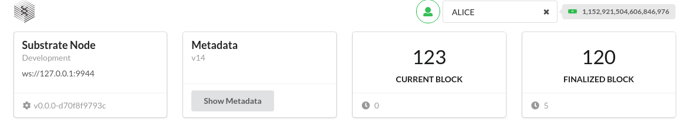
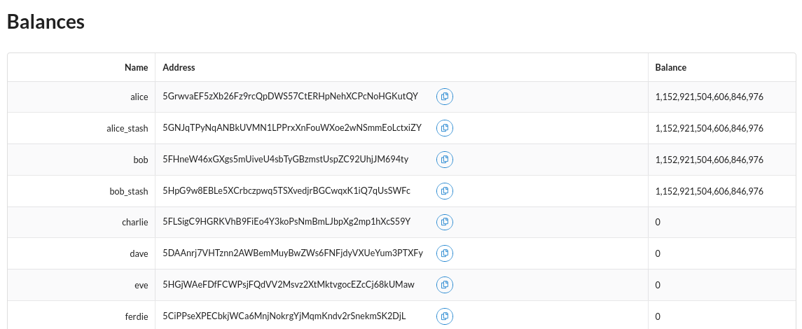
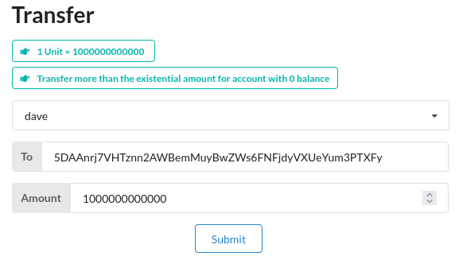
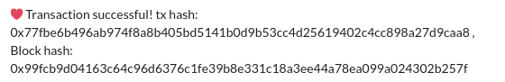
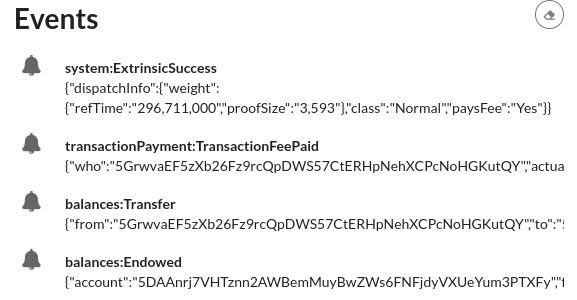
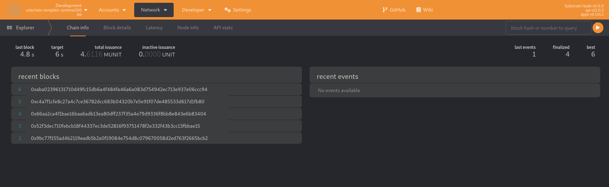
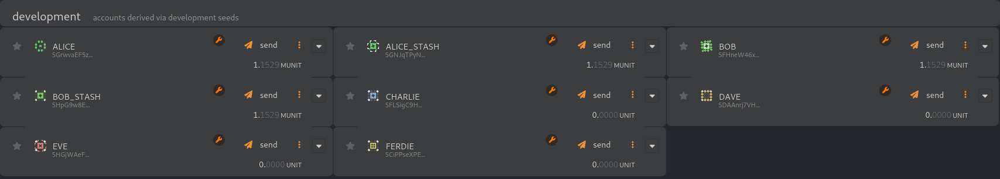
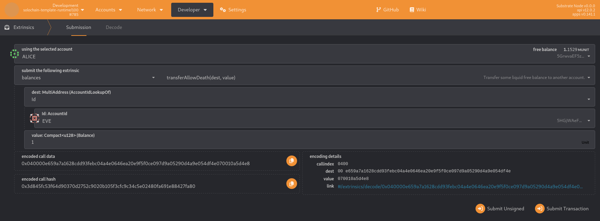
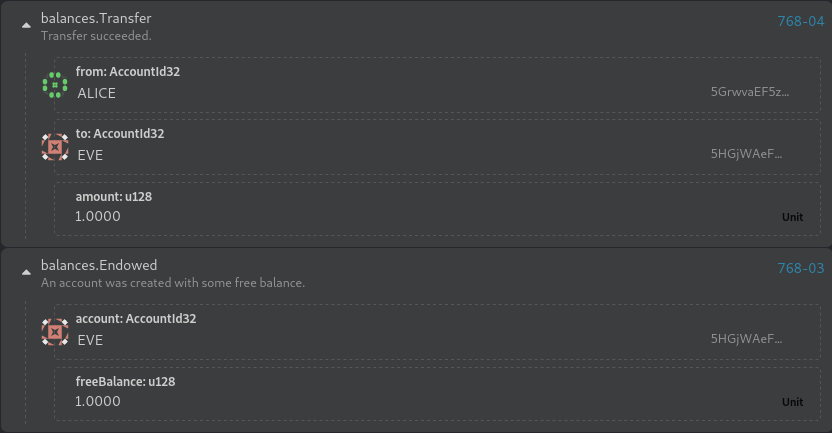

# Interacting With a Substrate Blockchain

---

# Build a local blockchain

```sh
git clone https://github.com/substrate-developer-hub/substrate-node-template
cd substrate-node-template
cargo build --release
```

- Clone and build the substrate node template.
- This will take 20 to 60 minutes

---

# Build a local blockchain

```sh
./target/release/node-template --dev
```

- This command will start the blockchain

---

# Build a local blockchain

<div style="font-size: 0.82em;">

```
2022-08-16 13:43:58 Substrate Node    
2022-08-16 13:43:58 ✌️  version 4.0.0-dev-de262935ede    
2022-08-16 13:43:58 ❤️  by Substrate DevHub <https://github.com/substrate-developer-hub>, 2017-2022    
2022-08-16 13:43:58 📋 Chain specification: Development
2022-08-16 13:43:58 🏷  Node name: limping-oatmeal-7460    
2022-08-16 13:43:58 👤 Role: AUTHORITY    
2022-08-16 13:43:58 💾 Database: RocksDb at /var/folders/2_/g86ns85j5l7fdnl621ptzn500000gn/T/substrate95LPvM/chains/dev/db/full    
2022-08-16 13:43:58 ⛓  Native runtime: node-template-100 (node-template-1.tx1.au1)
2022-08-16 13:43:58 🔨 Initializing Genesis block/state (state: 0xf6f5…423f, header-hash: 0xc665…cf6a)
2022-08-16 13:43:58 👴 Loading GRANDPA authority set from genesis on what appears to be first startup.
2022-08-16 13:43:59 Using default protocol ID "sup" because none is configured in the chain specs
2022-08-16 13:43:59 🏷  Local node identity is: 12D3KooWCu9uPCYZVsayaCKLdZLF8CmqiHkX2wHsAwSYVc2CxmiE
...
...
...
...
2022-08-16 13:54:26 💤 Idle (0 peers), best: #3 (0xcdac…26e5), finalized #1 (0x107c…9bae), ⬇ 0 ⬆ 0
```
- The terminal should display output similar to this.
- If the number after finalized is increasing, your blockchain is producing new blocks and reaching consensus about the state they describe.

---

# Interacting with the Substrate frontend template

```
git clone https://github.com/substrate-developer-hub/substrate-front-end-template
cd substrate-front-end-template
yarn install
yarn start
```
---

# Interacting with the Substrate frontend template

<div style="font-size: 0.90em;">


- Above shows the connected account and its balance. Alice is the developers account with sudo permission.
- The 1º block shows node address that is connected.
- The 2º shows the metadata version.
- The 3º shows the current block.
- The 4º shows the last finalized block.

---

# Interacting with the Substrate frontend template

<div style="font-size: 0.90em;">


---

# Interacting with the Substrate frontend template

<div style="font-size: 0.90em;">


- Select the account that we will transfer to.
- Put the amount of tokens we will transfer.
- 1 Token is equal to 1000000000000.

---

# Interacting with the Substrate frontend template

<div style="font-size: 0.90em;">


- After the successful transfer it will show the transaction hash and the block hash.

---

# Interacting with the Substrate frontend template



- The frontend will show the events done by the trasnfer.

---

# Interacting with the polkadot.js



- You can access [polkadot.js](https://polkadot.js.org/apps/?rpc=ws%3A%2F%2F127.0.0.1%3A9944#/explorer).
- On the homepage is possible to view the recent blocks and the events.

---

# Interacting with the polkadot.js



- On Accounts/Accounts we can see the developers accounts and the balance of each account.

---

# Interacting with the polkadot.js

<div style="font-size: 0.80em;">


- On the polkadot.js on Developer/Extrinsics. Here we can interact with the Pallets.
- Pallet is The FRAME development environment provides modules and support libraries that you can use, modify, and extend to build the runtime logic to suit the needs of your blockchain.

---

# Interacting with the polkadot.js



- On the Network/Explore we return to the homepage where we can see the transfer event.

---
## Interacting With a Substrate Blockchain


Notes:

Many of these interactions land in a wasm blob.

So what question you need to ask yourself there? which runtime blob.

almost all external communication happens over JSPN-RPC, so let's take a closer look.

---

## JSON-RPC

> JSON-RPC is a remote procedure call protocol encoded in JSON. It is similar to the XML-RPC
> protocol, defining only a few data types and commands.

---v

### JSON-RPC

```json
{
  "jsonrpc": "2.0",
  "method": "subtract",
  "params": { "minuend": 42, "subtrahend": 23 },
  "id": 3
}
```

<br />

```json
{ "jsonrpc": "2.0", "result": 19, "id": 3 }
```

<!-- .element: class="fragment" -->

---v

### JSON-RPC

- Entirely transport agnostic.
- Substrate based chains expose both `websocket` and `http` (or `wss` and `https`, if desired).

> with `--ws-port` and `--rpc-port`, 9944 and 9934 respectively.

---v

### JSON-RPC

- JSON-RPC methods are conventionally written as `scope_method`

  - e.g. `rpc_methods`, `state_call`

- &shy;<!-- .element: class="fragment" --> `author`: for submitting stuff to the chain.
- &shy;<!-- .element: class="fragment" --> `chain`: for retrieving information about the _blockchain_ data.
- &shy;<!-- .element: class="fragment" --> `state`: for retrieving information about the _state_ data.
- &shy;<!-- .element: class="fragment" --> `system`: information about the chain.
- &shy;<!-- .element: class="fragment" --> `rpc`: information about the RPC endpoints.

Notes:

Recall:

- <https://paritytech.github.io/substrate/master/sc_rpc_api/index.html>
- <https://paritytech.github.io/substrate/master/sc_rpc/index.html>

The full list can also be seen here: <https://polkadot.js.org/docs/substrate/rpc/>

---v

## JSON-RPC

```
npm install -g wscat
```

- For the next example we will need to install wscat a WebSocket cat.

---v

### JSON-RPC

- Let's look at a few examples:

- `system_name`, `system_chain`, `system_chainType`, `system_health`, `system_version`, `system_nodeRoles`, `rpc_methods`, `state_getRuntimeVersion`, `state_getMetadata`

```sh
wscat \
  -c wss://kusama-rpc.polkadot.io \
  -x '{"jsonrpc":"2.0", "id": 42, "method":"rpc_methods" }' \
  | jq
```

---v

### JSON-RPC: Runtime Agnostic

- Needless to say, RPC methods are runtime agnostic. Nothing in the above tells you if FRAME is
  being used or not.
- <!-- .element: class="fragment" --> Except... metadata, to some extent.

---v

### JSON-RPC: Runtime API

- While agnostic, many RPC calls land in a runtime API.
- &shy;<!-- .element: class="fragment" --> RPC Endpoints have an `at: Option<hash>`, runtime APIs do too, what a coincidence! 🌈
  - &shy;<!-- .element: class="fragment" --> Recall the scope `state`?

---v

### JSON-RPC: Extending

- The runtime can extend more custom RPC methods, but the new trend is to move toward using `state_call`.

---v

### JSON-RPC: Safety

- Some PRC methods are unsafe 😱.

---v

### JSON-RPC: Resilience

RPC-Server vs. Light Client

---

### JSON-RPC: Application

- On top of `SCALE` and `JSON-RPC`, a large array of libraries have been built.

- &shy;<!-- .element: class="fragment" --> `PJS-API` / `PJS-APPS`
- &shy;<!-- .element: class="fragment" --> `capi`
- &shy;<!-- .element: class="fragment" --> `subxt`
- &shy;<!-- .element: class="fragment" --> Any many more!

Notes:

<https://github.com/JFJun/go-substrate-rpc-client>
<https://github.com/polkascan/py-substrate-interface>
more here: <https://project-awesome.org/substrate-developer-hub/awesome-substrate>

---

### JSON-RPC: Mini Activity

In Kusama:

- Find the genesis hash..
- Number of extrinsics at block 10,000,000.
- The block number is stored under `twox128("System") ++ twox128("Number")`.
  - Find it now, and at block 10,000,000.

<br />

- Refer to the "Substrate; Show Me The Code" lecture to find the right RPC endpoints.
- You have 15 minutes!

Notes:

```sh
# 10,000,000 in hex
printf "%x\n" 10000000
# Genesis hash
wscat -c wss://kusama-rpc.polkadot.io -x '{"jsonrpc":"2.0", "id":72, "method":"chain_getBlockHash", "params": ["0x0"] }' | jq
# Hash of the block at height 10,000,000
wscat -c wss://kusama-rpc.polkadot.io -x '{"jsonrpc":"2.0", "id":72, "method":"chain_getBlockHash", "params": ["0x989680"] }' | jq
# The block at height 1,000,000
wscat -c wss://kusama-rpc.polkadot.io -x '{"jsonrpc":"2.0", "id":72, "method":"chain_getBlock", "params": ["0xdcbaa224ab080f2fbf3dfc85f3387ab21019355c392d79a143d7e50afba3c6e9"] }' | jq

# `0x26aa394eea5630e07c48ae0c9558cef702a5c1b19ab7a04f536c519aca4983ac` now.
wscat -c wss://kusama-rpc.polkadot.io -x '{"jsonrpc":"2.0", "id":72, "method":"state_getStorage", "params": ["0x26aa394eea5630e07c48ae0c9558cef702a5c1b19ab7a04f536c519aca4983ac"] }' | jq
# `0x26aa394eea5630e07c48ae0c9558cef702a5c1b19ab7a04f536c519aca4983ac` at block 1,000,000.
wscat -c wss://kusama-rpc.polkadot.io -x '{"jsonrpc":"2.0", "id":72, "method":"state_getStorage", "params": ["0x26aa394eea5630e07c48ae0c9558cef702a5c1b19ab7a04f536c519aca4983ac", "0xdcbaa224ab080f2fbf3dfc85f3387ab21019355c392d79a143d7e50afba3c6e9"] }' | jq
```

Notice that this number that we get back is the little endian (SCALE) encoded value that we passed in at first.

---

## Polkadot JS API

A brief introduction.

Excellent tutorial at: <https://polkadot.js.org/docs/>

---v

## Polkadot JS API


---v

### PJS: Overview

- `api.registry`
- `api.rpc`

---v

### PJS: Overview

Almost everything else basically builds on top of `api.rpc`.

- `api.tx`
- `api.query`
- `api.consts`
- `api.derive`

Please revise this while you learn FRAME, and they will make perfect sense!

---v

### PJS: Workshop 🧑‍💻

Notes:

```ts
import { ApiPromise, WsProvider } from "@polkadot/api";
const provider = new WsProvider("wss://rpc.polkadot.io");
const api = await ApiPromise.create({ provider });
api.stats;
api.isConnected;
 // where does this come from?
api.runtimeVersion;
// where does this come from?
api.registry.chainDecimals;
api.registry.chainTokens;
api.registry.chainSS58;
// where does this come from?
api.registry.metadata;
api.registry.metadata.pallets.map(p => p.toHuman());
api.registry.createType();
api.rpc.chain.getBlock()
api.rpc.system.health()
await api.rpc.system.version()
await api.rpc.state.getRuntimeVersion()
await api.rpc.state.getPairs("0x")
await api.rpc.state.getKeysPaged("0x", 100)
await api.rpc.state.getStorage()
await api.rpc.state.getStorageSize("0x3A636F6465"),
```

<https://polkadot.js.org/docs/substrate/rpc#getstoragekey-storagekey-at-blockhash-storagedata>

A few random other things:

```ts
api.createType("Balance", new Uint8Array([1, 2, 3, 4]));

import { blake2AsHex, xxHashAsHex } from "@polkadot/util-crypto";
blake2AsHex("Foo");
xxHashAsHex("Foo");
```

---

## `subxt`

- Something analogous to `PJS` for Rust.
- The real magic is that it generates the types by fetching the metadata at compile time, or linking
  it statically.
- ..It might need manual updates when the code, and therefore the metadata changes.

---

## Additional Resources! 😋

> Check speaker notes (click "s" 😉)

Notes:

- see "Client Libraries" here: <https://project-awesome.org/substrate-developer-hub/awesome-substrate>
- <https://paritytech.github.io/json-rpc-interface-spec/introduction.html>
- Full `subxt` guide: <https://docs.rs/subxt/latest/subxt/book/index.html>
